# 运动器材商城系统流程图

## 1. 用户注册流程

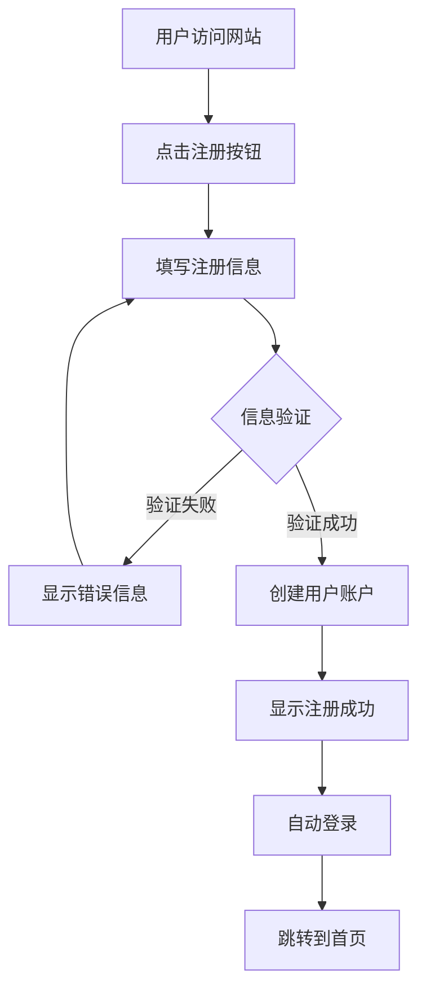

## 2. 用户登录流程

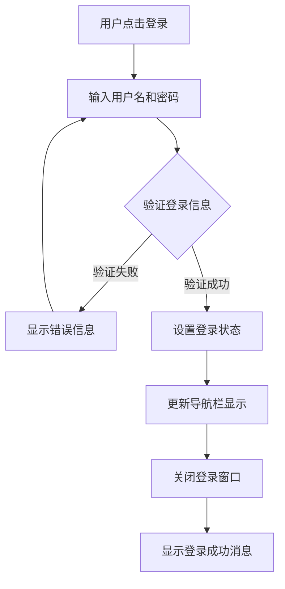

## 3. 商品浏览流程

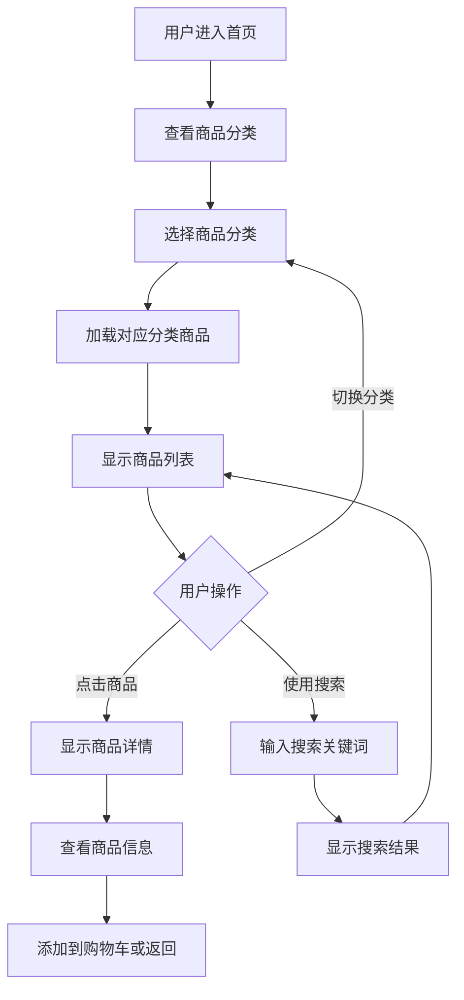

## 4. 购物车管理流程

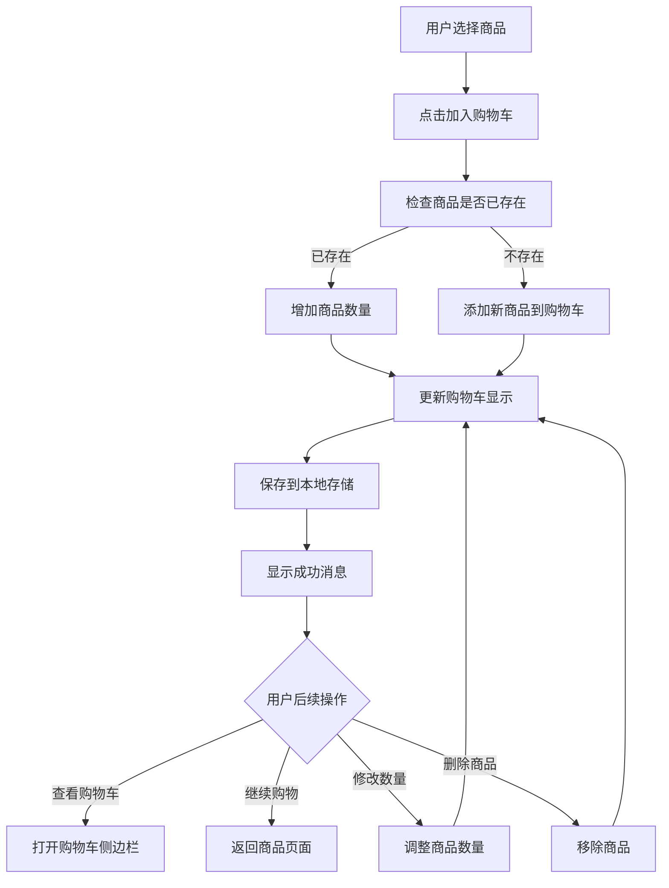

## 5. 订单结算流程

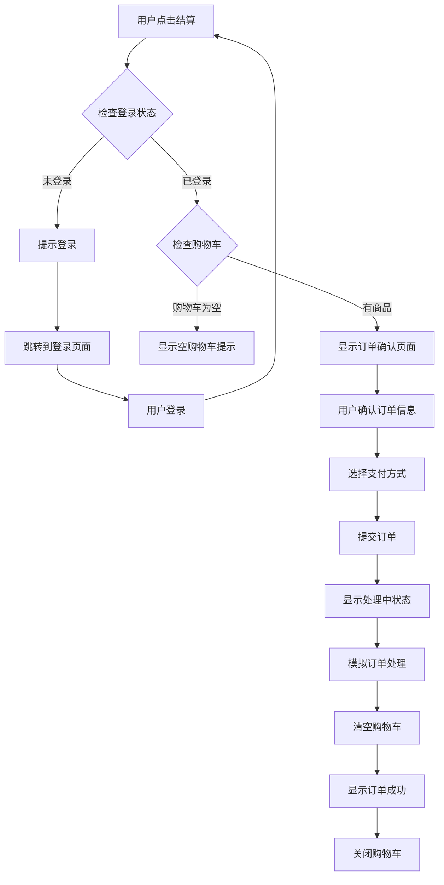

## 6. 商品搜索流程

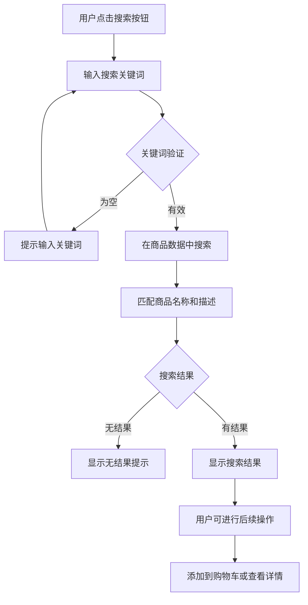

## 7. 轮播图控制流程

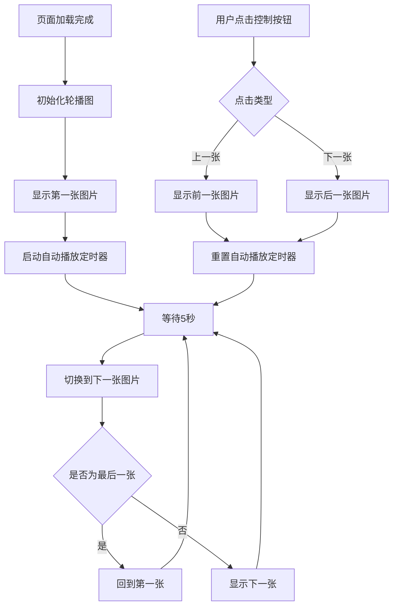

## 8. 响应式布局适配流程

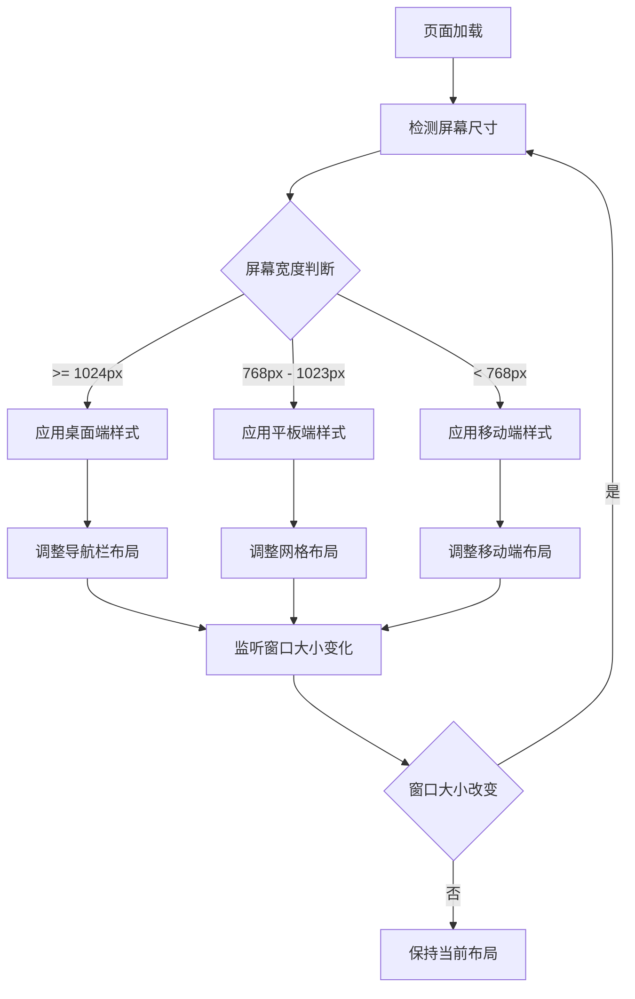

## 9. 数据持久化流程

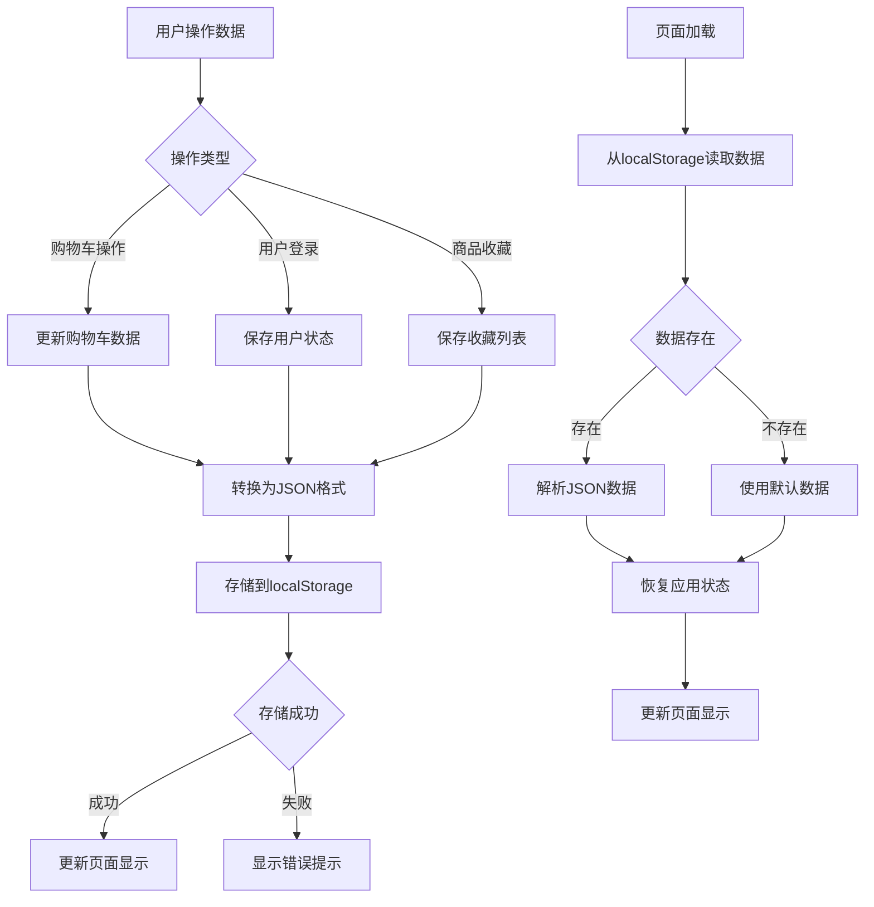

## 10. 错误处理流程

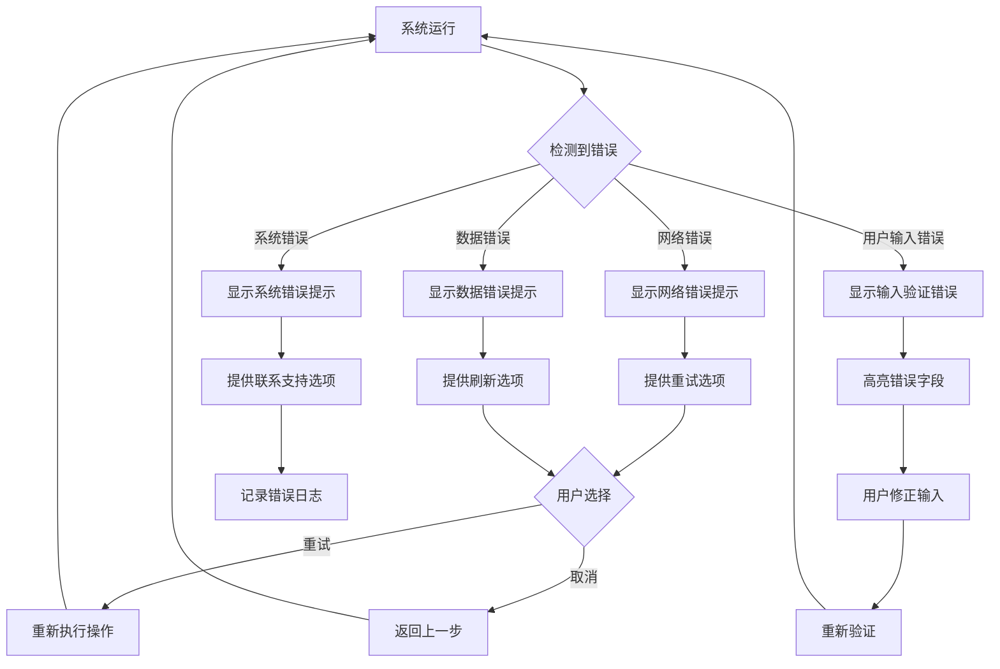

## 11. 性能优化流程

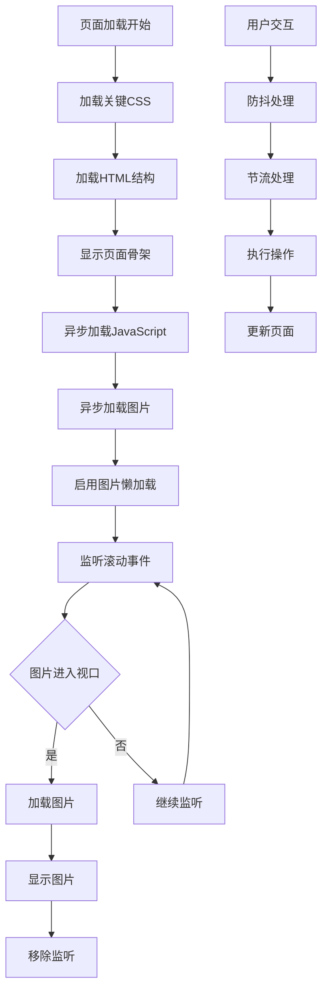

## 12. 系统整体业务流程

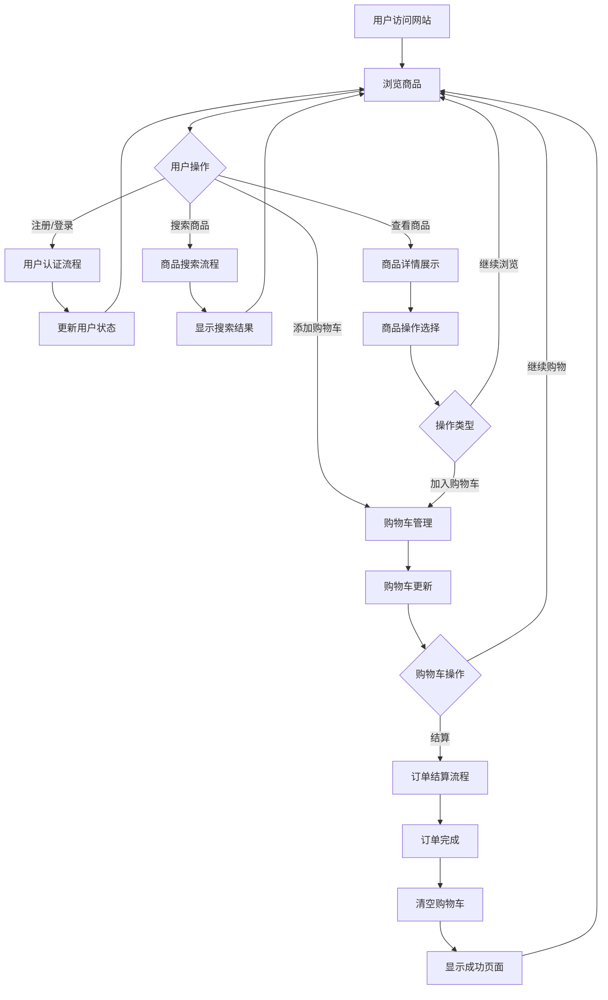

---

## 流程图说明

### 图例说明
- **矩形框**：表示处理步骤或操作
- **菱形框**：表示判断条件或分支
- **圆角矩形**：表示开始或结束
- **箭头**：表示流程方向
- **虚线**：表示可选流程

### 关键流程说明

1. **用户认证流程**：确保用户身份验证的安全性和便利性
2. **购物车管理**：提供完整的购物车操作体验
3. **订单处理**：简化结算流程，提高转化率
4. **数据持久化**：确保用户数据的可靠存储
5. **错误处理**：提供友好的错误处理机制
6. **性能优化**：确保良好的用户体验

### 技术实现要点

1. **异步处理**：使用Promise和async/await处理异步操作
2. **事件驱动**：基于事件的交互设计
3. **状态管理**：合理管理应用状态
4. **数据验证**：前端数据验证确保数据质量
5. **用户体验**：流畅的交互和及时的反馈

---

**文档版本**：1.0  
**创建日期**：2024年7月  
**最后更新**：2024年7月  
**创建人员**：系统设计师

<!-- 
来源: Claude AI助手
提示词: 创建运动器材商城的详细流程图，使用Mermaid语法描述各个业务流程
范围: 流程图.md 全文件
-->