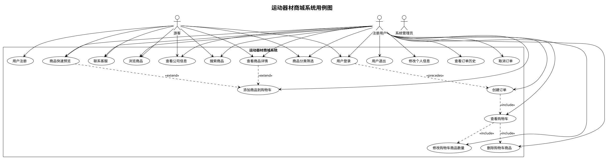
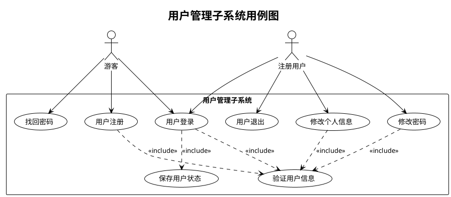
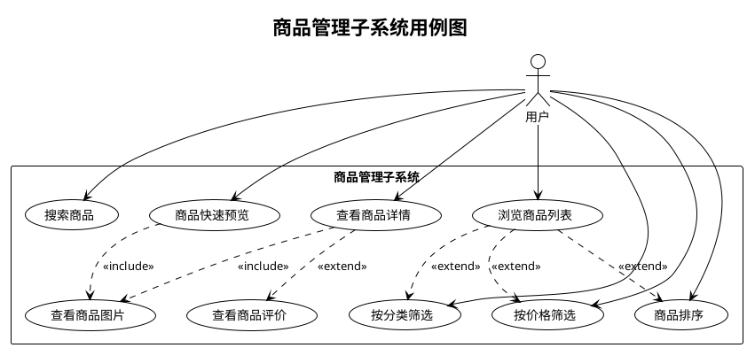
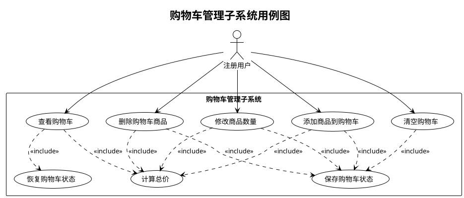
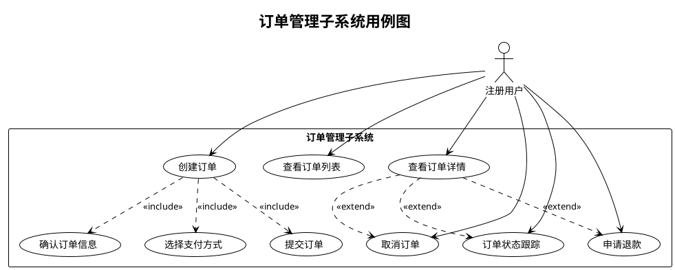
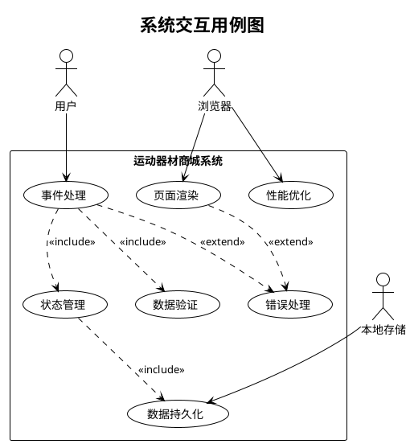

# 运动器材商城系统用例图

## 1. 系统整体用例图

## 2. 用户管理子系统用例图

## 3. 商品管理子系统用例图

## 4. 购物车管理子系统用例图

## 5. 订单管理子系统用例图

## 6. 系统交互用例图

## 7. 详细用例描述

### 7.1 用户注册用例

**用例名称**：用户注册  
**参与者**：游客  
**前置条件**：用户访问网站  
**后置条件**：用户账户创建成功  

**主要流程**：
1. 用户点击注册按钮
2. 系统显示注册表单
3. 用户填写注册信息（用户名、邮箱、密码）
4. 用户提交注册表单
5. 系统验证输入信息
6. 系统创建用户账户
7. 系统显示注册成功消息
8. 系统自动登录用户

**异常流程**：
- 3a. 用户输入信息不完整：系统提示补充信息
- 5a. 用户名已存在：系统提示选择其他用户名
- 5b. 邮箱格式错误：系统提示正确的邮箱格式
- 5c. 密码不符合要求：系统提示密码要求

### 7.2 添加商品到购物车用例

**用例名称**：添加商品到购物车  
**参与者**：注册用户  
**前置条件**：用户已登录，正在浏览商品  
**后置条件**：商品成功添加到购物车  

**主要流程**：
1. 用户选择要购买的商品
2. 用户点击"加入购物车"按钮
3. 系统检查商品是否已在购物车中
4. 系统更新购物车数据
5. 系统更新购物车显示
6. 系统保存购物车状态到本地存储
7. 系统显示添加成功消息

**异常流程**：
- 2a. 用户未登录：系统提示登录
- 3a. 商品已在购物车：系统增加商品数量
- 6a. 存储失败：系统显示错误消息

### 7.3 创建订单用例

**用例名称**：创建订单  
**参与者**：注册用户  
**前置条件**：用户已登录，购物车中有商品  
**后置条件**：订单创建成功，购物车清空  

**主要流程**：
1. 用户点击结算按钮
2. 系统检查用户登录状态
3. 系统检查购物车是否为空
4. 系统显示订单确认页面
5. 用户确认订单信息
6. 用户选择支付方式
7. 用户提交订单
8. 系统处理订单
9. 系统清空购物车
10. 系统显示订单成功页面

**异常流程**：
- 2a. 用户未登录：系统跳转到登录页面
- 3a. 购物车为空：系统显示空购物车提示
- 8a. 订单处理失败：系统显示错误信息

## 8. 用例优先级分析

### 高优先级用例
1. **浏览商品** - 核心功能，用户访问的主要目的
2. **添加商品到购物车** - 购物流程的关键步骤
3. **用户注册/登录** - 用户身份管理的基础
4. **创建订单** - 完成购买的最终步骤

### 中优先级用例
1. **搜索商品** - 提高用户体验的重要功能
2. **查看购物车** - 购物流程的重要环节
3. **修改购物车** - 购物车管理功能
4. **商品分类筛选** - 商品浏览的辅助功能

### 低优先级用例
1. **查看订单历史** - 用户管理的扩展功能
2. **修改个人信息** - 用户管理的辅助功能
3. **联系客服** - 客户服务功能
4. **商品快速预览** - 用户体验优化功能

## 9. 用例实现策略

### 第一阶段（核心功能）
- 实现商品浏览和展示
- 实现基本的购物车功能
- 实现用户注册和登录
- 实现简单的订单创建

### 第二阶段（功能完善）
- 完善购物车管理功能
- 添加商品搜索和筛选
- 优化用户界面和交互
- 添加数据持久化

### 第三阶段（体验优化）
- 添加高级搜索功能
- 实现响应式设计
- 添加动画和交互效果
- 性能优化和错误处理

---

**文档版本**：1.0  
**创建日期**：2024年7月  
**最后更新**：2024年7月  
**创建人员**：系统分析师

<!-- 
来源: Claude AI助手
提示词: 创建运动器材商城的详细用例图，使用PlantUML语法描述系统用例关系
范围: 用例图.md 全文件
-->